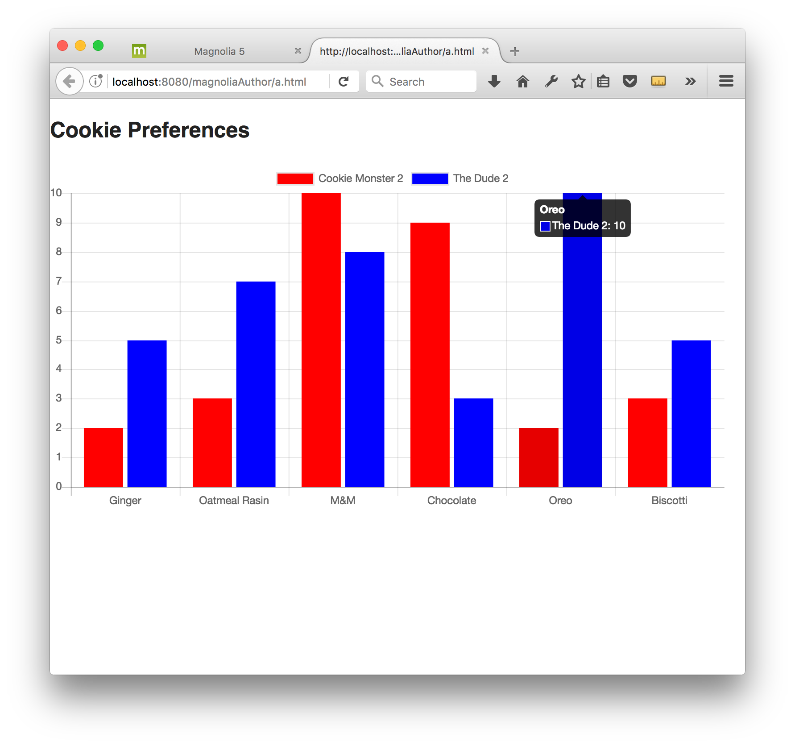
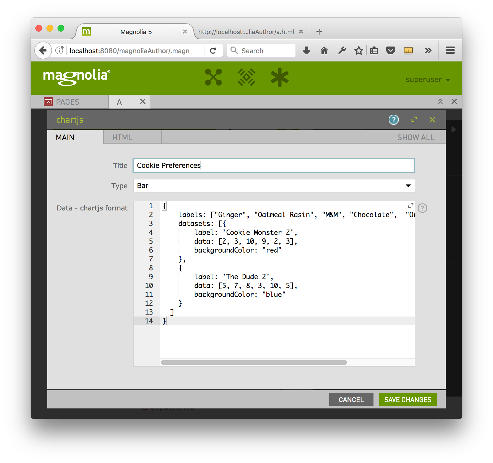

# Chartjs - Component template for Magnolia CMS #

Add a chart to your website. Simple implementation of the full-featured https://chartjs.org library.

## Features ##
Choose a chart type from: bar, line, radar and polarArea.

Provide the data in the dialog in chartjs JSON format.

This component supports only a small subset of chartjs features.

## Usage ##
The files in webresources must be included on the page.

### Sample ###
To see an sample page demonstrating this components, open the Pages app in Magnolia AdminCentral and import the file in `_dev/samples`.

## Information on Magnolia CMS
https://docs.magnolia-cms.com

This directory is a 'light module'.
https://documentation.magnolia-cms.com/display/DOCS/Light+development+in+Magnolia

## Contribute to the Magnolia component ecosystem
It's easy to create components for Magnolia and share them on github and npm. I invite you to do so and join the community. Let's stop wasting time by developing the same thing again and again, rather let's help each other out by sharing our work and create a rich library of components.

Just add magnolia-light-module to the package.json to make them easy to find and use.

## Notes
* This is not officially supported Magnolia CMS code. This is a community contribution.
* Your input is welcome! Just file a ticket, or create a pull request on github.

## License

MIT

## Contributors

Christopher Zimmermann, @topherzee
